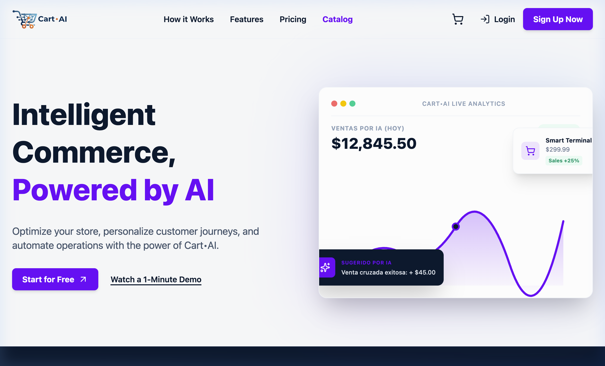

# Cart•AI - Frontend Web Client

<p align="center">
  
</p>

This repository contains the official frontend User Interface (UI) for **Cart•AI**, a modern AI-powered e-commerce and automated sales analytics platform.

This web project is architected as a decoupled, white-labeled client, prepared to consume CartAI's backend APIs and services.

* **Git Repository**: [https://github.com/robertoDiaz/CartAI-Web](https://github.com/robertoDiaz/CartAI-Web)

---

## E-Commerce Landing Page Screenshot

<p align="center">
  
</p>

---

## Core Features

* 🌐 **Strict Translation System (i18n)**: Out-of-the-box support for English and Spanish, dynamically driven by semantic translation functions (`translate`). Zero default fallback strings are allowed in code, ensuring all UI text strictly maps to local dictionary definitions.
* 🔒 **JWT Session Watcher**: Real-time client-side monitoring of token expiration, displaying a 60-second warning countdown toast with a quick session extension action (renews JWT), automatically loging out and alerting the user upon expiration.
* 🚨 **System Recovery Overlay**: A premium maintenance and system error screen with light glow effects that automatically intercepts backend server errors (5xx/network loss), featuring auto-polling in the background to automatically restore screen access once the server is back online.
* 🛒 **Zustand State Store**: Immutable cart state management with per-product stock boundaries and local persistence via `localStorage`.
* 🎨 **Hot Theme Merging (White-labeling)**: Support for overrides in the color system via an external config file (`public/theme-custom.json`). This dynamically merges with an internal corporate fallback config at startup without breaking the layout.
* 📈 **Interactive Analytics Dashboard**: A high-fidelity Hero dashboard featuring animated SVG sales chart gradients, simulated real-time metrics, and AI recommendation cards.

---

## Tech Stack

* **Vite** (v8.1.0) & **React** (v19.2.7)
* **TypeScript** (Strict mode with `verbatimModuleSyntax`)
* **Zustand** (Lightweight immutable state manager)
* **React Router Dom** (Client-side routing)
* **TailwindCSS v4** (Utility-first styling framework)
* **i18next & react-i18next** (Internationalization motor)

---

## Local Setup & Development

### Prerequisites

* Node.js (v18 or higher)
* npm or yarn

### Steps

1. Clone the repository:
   ```bash
   git clone https://github.com/robertoDiaz/CartAI-Web.git
   cd CartAI-Web
   ```
2. Install the required dependencies:
   ```bash
   npm install
   ```
3. Run the local development server:
   ```bash
   npm run dev
   ```
4. Build the production-ready optimized bundle:
   ```bash
   npm run build
   ```

---

## Author & Creator

* **Roberto Díaz** - [robertoDiaz](https://github.com/robertoDiaz)

---

## License

This project is licensed under the **GNU General Public License v3.0 (GPL-3.0)**. See the [LICENSE](LICENSE) file for details.

